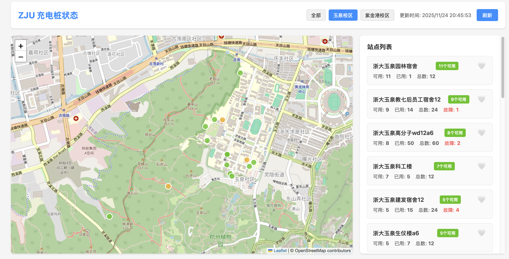
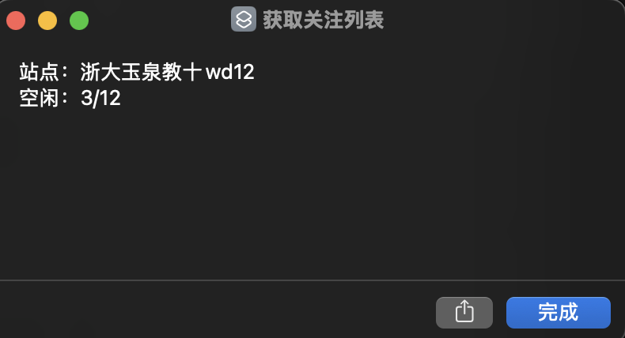

# ZJU Charger

> 基于 FastAPI 的浙江大学充电桩状态查询系统，根据尼普顿提供的 API 接口，实现充电桩状态查询、关注列表、钉钉机器人交互等功能。

## 系统架构

```text
                     +----------------------+
                     |    GitHub Action     |
                     |（定时/手动触发抓取） |
                     +-----------+----------+
                                 |
                          /api/fetch-and-save
                                 |
                        写入 data/latest.json
                                 |
                                 v
+-----------+       +------------+-------------+         +----------------+
| 本地网页  | <---> |    FastAPI API 服务     |   <----> |   钉钉机器人   |
| index.html|  ajax | /api/status 实时查询     | webhook |  查询/关注/全部 |
+-----------+       +------------+-------------+         +----------------+
                                 ^
                                 |
                                 v
                      +----------------------+
                      |    Fetcher（实时）   |
                      +----------------------+
                                 ^
                                 |
                                 |
                     +-----------+------------+
                     |      iOS 快捷指令       |
                     |------------------------|
                     | 1. 关注点快速查询         |
                     +------------------------+

```

- 地图使用 OpenStreetMap 瓦片图层，并使用 WGS84 坐标系，为解决国内地图坐标偏移问题，使用了 [wandergis/coordtransform](https://github.com/wandergis/coordtransform) 提供了百度坐标（BD09）、国测局坐标（火星坐标，GCJ02）、和WGS84坐标系之间的转换函数

所有查询来源（网页、钉钉、GitHub Action）都调用统一 API 和 Fetcher，逻辑完全不重复。

## 功能特性

- [x] 异步并发抓取，大幅提升查询速度
- [x] FastAPI 统一 API 接口
- [x] 网页地图可视化（Leaflet）
- [ ] 钉钉机器人交互（查询/关注/全部）
- [ ] GitHub Action 自动定时抓取
- [ ] GitHub Pages 静态部署支持





## 项目结构

```text
project/
├── fetcher/
│   └── fetch.py          # 统一抓取逻辑（异步）
├── server/
│   ├── api.py            # FastAPI 主服务
│   ├── storage.py        # 数据存储管理
│   └── config.py         # 环境变量配置
├── ding/
│   ├── bot.py            # 钉钉机器人封装
│   ├── webhook.py        # 钉钉 webhook 路由
│   └── commands.py       # 命令解析和执行
├── web/                  # 前端文件
│   ├── index.html        # 地图+列表页面
│   ├── script.js         # 前端逻辑
│   └── style.css         # 样式文件
├── data/                 # 数据目录
│   ├── latest.json       # 最新状态缓存
│   └── watchlist.json    # 用户关注列表
├── script/               # iOS 快捷指令
│   ├── README.md         # 快捷指令使用说明
│   └── *.shortcut        # 快捷指令文件
├── .github/workflows/
│   └── fetch.yml         # GitHub Action workflow
├── main.py               # 独立运行脚本（向后兼容）
├── location.json         # 站点配置
└── requirements.txt      # 依赖库
```

## 快速开始

### 1. 安装依赖

```bash
pip install -r requirements.txt
```

### 2. 配置环境变量

编辑 `.env` 文件：

```env
# 微信 openId（必需）
OPENID=your_openid_here

# 钉钉机器人配置（可选）
DINGTALK_WEBHOOK=https://oapi.dingtalk.com/robot/send?access_token=xxx
DINGTALK_SECRET=your_secret_here

# API 服务器配置
API_HOST=0.0.0.0 # 服务器地址
API_PORT=8000 # 服务器端口
```

参数获取方法：通过抓包获取微信小程序中的请求参数。

## 使用方式

### 方式一：FastAPI 服务器（推荐）

启动 FastAPI 服务器：

```bash
# 方式1：使用 uvicorn
uvicorn server.api:app --host 0.0.0.0 --port 8000

# 方式2：直接运行
python -m server.api
```

访问：

- API 文档：`http://localhost:8000/docs` or `http://your-server:8000/docs`
- 前端页面：`http://localhost:8000/web/index.html` or `http://your-server:8000/web/index.html`

#### API 端点

- `GET /api/status` - 实时查询所有站点
- `POST /api/fetch-and-save` - 抓取并保存数据（GitHub Action 使用）
- `GET /api/cache` - 返回缓存数据
- `GET /api/watchlist` - 返回关注列表站点状态
- `GET /api/watchlist/list` - 返回关注列表 devid 和 devdescript 列表
- `POST /api/watchlist` - 添加到关注列表（请求体：`{"devids": [devid1, ...], "devdescripts": ["站点名1", ...]}`，两者可同时提供或只提供其中一个）
- `DELETE /api/watchlist` - 从关注列表移除（请求体：`{"devids": [devid1, ...], "devdescripts": ["站点名1", ...]}`，两者可同时提供或只提供其中一个）
- `POST /ding/webhook` - 钉钉机器人 webhook

### 方式二：独立运行脚本（向后兼容）

```bash
# 从 URL 提取 openId
python main.py "<url>"

# 或使用环境变量中的 openId
export OPENID=your_openid
python main.py
```

### 方式三：钉钉机器人

1. 配置钉钉机器人 webhook 和 secret（在 `.env` 中）
2. 在钉钉群中添加机器人
3. 配置机器人的 webhook URL 为：`http://your-server:8000/ding/webhook`

#### 可用命令

- `查询` - 查看关注列表站点状态
- `全部` - 查看所有站点状态
- `关注 站点名` - 添加站点到关注列表

例如：

```text
关注 教七
```

### 方式四：iOS 快捷指令

1. 打开 iOS 设备上的「快捷指令」App
2. 参考 `script/` 目录下的文档创建快捷指令：
   - `README.md` - 使用说明和快捷指令列表

3. 可用的快捷指令：
   - **查询关注列表** - 查询已关注站点的状态

详细说明请参考 `script/README.md`

### 方式五：GitHub Action 自动抓取

1. 在 GitHub 仓库设置中添加 Secret：
   - `API_URL`: 你的 FastAPI 服务器地址（例如：`https://your-server.com`）

2. GitHub Action 会自动：
   - 每 30 分钟定时抓取
   - 手动触发抓取
   - 将结果保存到 `data/latest.json`
   - 自动提交到仓库

3. 配置 GitHub Pages：
   - 启用 GitHub Pages
   - 源目录设置为 `/web`
   - 访问：`https://yourname.github.io/charge-status/`

## 开发说明

### 添加新的 API 端点

在 `server/api.py` 中添加新的路由：

```python
@app.get("/api/new-endpoint")
async def new_endpoint():
    return {"message": "Hello"}
```

### 添加新的钉钉命令

1. 在 `ding/commands.py` 的 `parse_command()` 中添加命令解析
2. 添加对应的执行函数
3. 在 `ding/webhook.py` 中添加处理逻辑

### 修改前端

前端文件位于 `web/` 目录：

- `index.html` - 页面结构
- `script.js` - 前端逻辑
- `style.css` - 样式

## 部署

### 生产环境部署（TODO: 待实现）

使用 uvicorn 部署：

```bash
uvicorn server.api:app --host 0.0.0.0 --port 8000 --workers 4
```

或使用 gunicorn：

```bash
gunicorn server.api:app -w 4 -k uvicorn.workers.UvicornWorker -b 0.0.0.0:8000
```

### Docker 部署（TODO: 待实现）

创建 `Dockerfile`：

```dockerfile
FROM python:3.9-slim
WORKDIR /app
COPY requirements.txt .
RUN pip install -r requirements.txt
COPY . .
CMD ["uvicorn", "server.api:app", "--host", "0.0.0.0", "--port", "8000"]
```

## 注意事项

- `location.json` 需要自行创建（项目中没有提供）
- 所有敏感信息（openId、webhook 等）通过环境变量配置
- `data/` 目录需要添加到 `.gitignore`，但 `latest.json` 和 `watchlist.json` 需要被 Git 跟踪
- 钉钉 webhook 需要验证签名防止伪造请求
- 前端需要处理 API 调用失败的情况（fallback 到静态文件）

## 许可证

见 LICENSE 文件

## 贡献

欢迎提交 Issue 和 Pull Request！

## 致谢

- 感谢 [cyc-987/Charge-in-ZJU: 浙大充电桩查询](https://github.com/cyc-987/Charge-in-ZJU) 的原作者 [@cyc-987](https://github.com/cyc-987)，为该项目提供了基础功能和灵感
- 感谢 [leaflet-echarts](https://github.com/wandergis/leaflet-echarts)
- 感谢 [wandergis/coordtransform](https://github.com/wandergis/coordtransform) 提供了百度坐标（BD09）、国测局坐标（火星坐标，GCJ02）、和WGS84坐标系之间的转换函数
